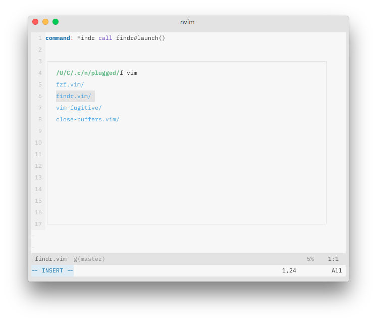

# Findr.vim
An incremental file finder for nvim, inspired by [ivy](https://github.com/abo-abo/swiper) find-file

## Requirements
* `nvim`: version > 0.4.0

## TODO
* Scrolling
* History
* Configuration
