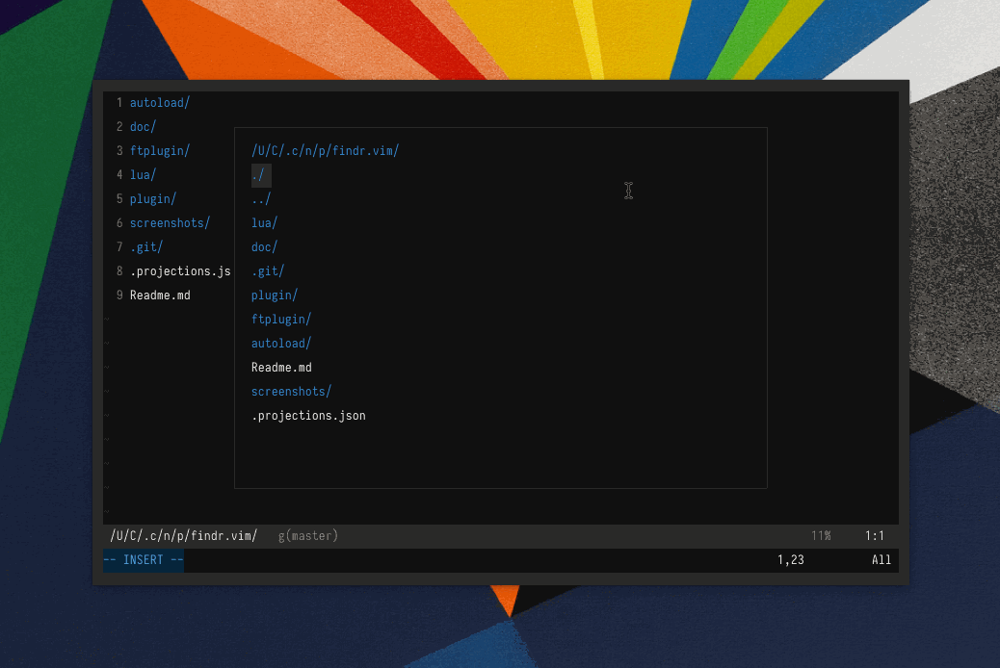

# Findr.vim

An incremental narrowing engine for (neo)vim, inspired by
[ido](https://www.gnu.org/software/emacs/manual/html_mono/ido.html),
[ivy](https://github.com/abo-abo/swiper), and
[helm](https://github.com/emacs-helm/helm)



## Requirements

-   `nvim`: version \> 0.4.3
-   `vim:` version \> 8.0, +lua
    -   Note floating fidnr windows are not supported for vim as of
        right now
-   macos/linux

## Installation

Using [vim-plug](https://github.com/junegunn/vim-plug):

``` vim
Plug 'conweller/findr.vim'
```

## Commands

File finder: `:Findr`

Buffer selector: `:FindrBuffers`

Location List selector: `:FindrLocList`

Quickfix List selector: `:FindrQFList`

## Usage

Launch file finder with one of the above commands

Inside a findr buffer, filter subdirectories/files by entering in the
desired pattern

You can delimit multiple patterns you are searching for with a space.

The first matching item is selected by default, you can select a
different item using `<c-p>` (or `<up>` or `<c-k>`) for the previous
item, or `<c-n>` (or `<down>` or `<c-j>`) for the next item

Use `<cr>` to choose an item

Use `<tab>`, `/`, or `<c-l>` to change to the selected directory (inside
a file finder buffer)

Use `<c-h>` or use `<bs>` when the cursor is right of the prompt to go
to the parent directory (inside a file finder buffer)

Use `<m-p>` and `<m-n>` (or `<s-up>` and `<s-down>`) to go through your
history of recent files/directories (inside a file finder buffer)

## Configuration

`g:findr_highlight_matches` Enable/disable highlights for matches
(default 1)

``` vim
let g:findr_highlight_matches = 0
```

`g:findr_floating_window` Enable/disable floating window (default 1)

``` vim
let g:findr_floating_window = 1
```

`g:findr_enable_border` Enable/disable border around floating window
(default 1)

``` vim
let g:findr_enable_border = 0
```

`g:findr_max_hist` Set maximum history file length (default 100)

``` vim
let g:findr_max_hist = 100
```

`g:findr_border` Set characters for window border:

``` vim
let g:findr_border = {
    \   'top':    ['┌', '─', '┐'],
    \   'middle': ['│', ' ', '│'],
    \   'bottom': ['└', '─', '┘'],
    \ }
```

For additional documentation see:

``` vim
:h findr
```
